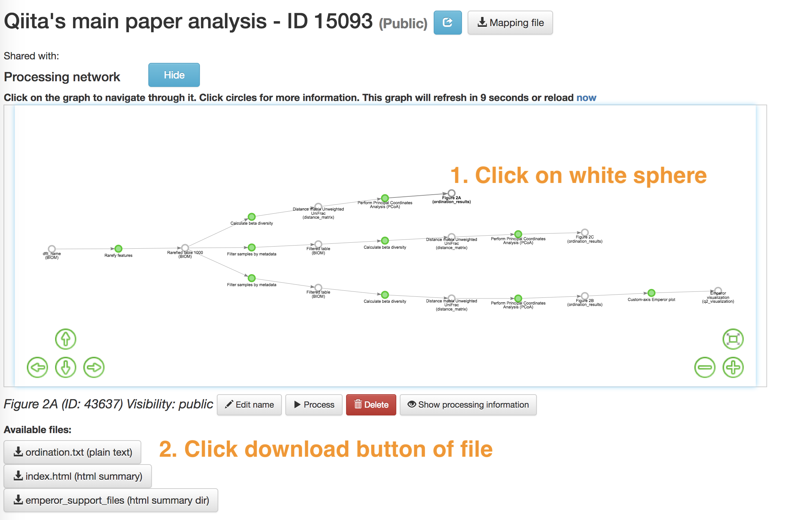

# Reproducing Figure 2

> To download the files below, you need to open the analysis, then (1) click on the white sphere of interest, for
> example 2A, and then click on the download button, see:
>
> 
>

Figure 2A-C were fully generated in Qiita, to get the same coloring and shapes that were used in the manuscript, you can access each of the individual plots and load the Emperor settings directly. The main analysis can be found within [Qiita](https://qiita.ucsd.edu/analysis/description/15093/), you must be log in to Qiita to be able to access it.

Figure 2A was generated using the artifact [`Figure 2A (ID: 43637)`](https://qiita.ucsd.edu/artifact/html_summary/ordination_results/43637/index.html), to regenerate the coloring scheme you can load the file `emperor-settings-43637.json` within this repository.

Figure 2B was generated using the artifact [`Figure 2B (ID: 43666)`](https://qiita.ucsd.edu/artifact/html_summary/ordination_results/43666/index.html), to regenerate the coloring scheme you can load the file `emperor-settings-43666.json` within this repository.

Figure 2C was generated using the artifact [`Figure 2C (ID: 43729)`](https://qiita.ucsd.edu/artifact/html_summary/ordination_results/43729/index.html), to regenerate the coloring scheme you can load the file `emperor-settings-43729.json` within this repository.

## Reproducing Figure 2D

To open the Jupyter notebook you will need Python 3.5 and these packages:
```
pip install setuptools==20.10.1
pip install scipy ipython[all] autopep8 seaborn https://github.com/ElDeveloper/reference-plane/archive/master.zip
```

Then to start you will need the `ordination.txt` (MD5 (ordination.txt) = ffe524eeab2075b6951846b6846bad2f) from [Figure 2C](https://qiita.ucsd.edu/artifact/html_summary/ordination_results/43729/index.html), or use the one provided in this repo (MD5 (ordination.txt.gz) = 981e9965259aa6aa6fa268f43a07b4ed.
